# Zero. Personal And Company AI Operating System

Zero is Adam's chief-of-staff and the active software home for **ADA AI LLC Company OS**. The personality you hear through Reachy Mini ("Hey Zero") is Zero. It is a FastAPI backend on `:18792` plus a React/Vite UI on `:5173`, with PostgreSQL + pgvector for retrieval, a local vLLM stack for privacy-safe inference, and a shared LiteLLM router at `:4444` for cloud fallback.

Zero combines the personal assistant, second brain, company task cockpit, approvals, docs context, consulting / product / robotics operations, content automation, voice, vault, journaling, habits, goals, vision, ecosystem health, and Reachy Mini control into one operating surface.

This file is the canonical source of truth for what Zero does and contains. It is intentionally self-contained: a new reader (human or agent) should be able to land here and not need to open another file to understand the project.

## Table of contents

1. [What is Zero](#what-is-zero)
2. [What Zero does](#what-zero-does)
3. [What Zero does NOT do](#what-zero-does-not-do)
4. [Architecture at a glance](#architecture-at-a-glance)
5. [Major subsystems](#major-subsystems)
6. [Voice stack](#voice-stack)
7. [Vault contract](#vault-contract)
8. [Retrieval architecture](#retrieval-architecture)
9. [LLM routing](#llm-routing)
10. [Storage](#storage)
11. [Approval tiers](#approval-tiers)
12. [Cross-project bridges](#cross-project-bridges)
13. [Quick start](#quick-start)
14. [Ports](#ports)
15. [File structure](#file-structure)
16. [Stage roadmap](#stage-roadmap)
17. [PR #1 integration guardrails](#pr-1-integration-guardrails)
18. [Where to look next](#where-to-look-next)

## What is Zero

Zero is the **chief-of-staff**. It is Adam's interface to his own life and the active operating surface for Doherty Applied AI Company OS. The personality the user talks to through Reachy Mini ("Hey Zero") is Zero. Zero is *not* a coding orchestrator (that is Legion's job) and *not* a trader (that is Ada's job). When something requires deep code work or a trading decision, Zero **delegates** to Legion or Ada via MCP and summarizes the result back.

**Naming boundary.** *Zero* is the assistant, product, and robot identity users see. *Reachy Mini* is the vendor / hardware platform. `reachy_*`, `ZERO_REACHY_*`, SDK names, daemon names, and DB / API compatibility identifiers stay in place until a deliberate compatibility migration is planned.

## What Zero does

Zero owns the following domains end-to-end. Each row is the canonical file or service location.

| Domain | Files / services |
|---|---|
| Voice & Reachy | `backend/app/services/reachy_*.py`, `voice_bridge_service.py`, `reachy_wake_word_service.py` |
| Vault writes | `backend/app/services/vault_writer_service.py` (Stage 1: cyanheads MCP) |
| Vault retrieval | `vault_indexer_service.py`, `vault_retrieval_service.py` (pgvector + BM25 + RRF + partitions) |
| Calendar / email | `email_draft_service.py`, GCal MCP wiring (Stage 2) |
| Journal / habits / goals | `journal_service.py`, `habit_service.py`, `goal_tracking_service.py` |
| Daily routine | `daily_routine_service.py`, `morning_digest_service.py` |
| Vision | `vision_service.py` + Reachy camera frames |
| Ecosystem health surfacing | `ecosystem_health_service.py` |
| Company OS | `docs/company/`, `/company/*` UI routes, `/api/company/*` context and task surfaces |
| Memory Vault | `/vault/00_Meta/_agent/memory_vault/`, `/api/memory-vault/*`, `vault_writer_service.py` |
| Meeting Steward | `backend/app/services/meeting_*.py`, `meeting_processing_pipeline.py`, faceprints + voiceprints |
| TikTok Shop pipeline | `backend/app/services/tiktok_*.py` (research, enrich, generate, approve, post) |
| Autonomous research | `vault_writer_service.py` writing to `00_Meta/_agent/research/` every 15 min |

## What Zero does NOT do

- Does not commit code or open PRs (Legion's job).
- Does not place trades, paper or live (Ada's job. Ada gates live).
- Does not file LLC / tax / legal paperwork, buy subscriptions or hardware, send client communications, publish public company changes, or change accounts without an explicit approval record.
- Does not write to the vault outside `00_Meta/_agent/` without using cyanheads MCP and respecting the `agent_writable` frontmatter whitelist (Stage 1).
- Does not write Memory Vault chunks from HTTP or integrations without an approval record. `/api/memory-vault/*` queues approvals; internal writers must use the canonical `/vault/00_Meta/_agent/memory_vault/` root with audit metadata.
- Does not mark Gmail or Calendar connected without real OAuth tokens.
- Does not execute browser control, Telegram send, trigger webhooks / tools, OpenHands dispatch, or other external / local-write side effects without the approval tier contract.
- Does not claim Meeting Agent or OpenHands are operational unless real runtime drivers are enabled and healthy.
- Does not touch Eightfold (work) material. `partition: work` is hard-dropped by the vault constitution.
- Does not run unattended LLM eval matrices (Legion's `llm-ops` subgraph).

## Architecture at a glance

```mermaid
graph TB
    subgraph Surfaces["User surfaces"]
        UI["React UI :5173"]
        API["REST :18792"]
        Voice["Reachy Mini :8000<br/>(USB-C + REST)"]
        SDK["Claude Agent SDK<br/>(Discord / WhatsApp / Slack)"]
    end

    subgraph Vault["Obsidian vault (source of truth)"]
        Daily["20_Calendar/Daily/"]
        Atlas["10_Atlas/MOCs"]
        Efforts["30_Efforts/"]
        AgentNS["00_Meta/_agent/<br/>(agent-owned namespace)"]
        Inbox["_Inbox/"]
    end

    subgraph Cognition["Cognition"]
        Indexer["vault_indexer_service<br/>watchdog + chunker + embedder"]
        Retriever["vault_retrieval_service<br/>BM25 + dense + RRF + journal time-decay"]
        Writer["vault_writer_service<br/>(Stage 1: cyanheads MCP)"]
        Routine["daily_routine_service<br/>+ morning_digest_service"]
    end

    subgraph PersonalLayer["Personal layer"]
        Mem["memory_service"]
        Goal["goal_tracking_service"]
        Habit["habit_service"]
        Journal["journal_service"]
        Email["email_draft_service"]
        Feedback["feedback_service"]
        Context["context_awareness_service"]
        Cross["cross_domain_service"]
        Proactive["proactive_service"]
        Health["ecosystem_health_service"]
    end

    subgraph CompanyOS["Company OS layer"]
        CompanyUI["/company routes"]
        CompanyDocs["docs/company"]
        CompanyCtx["company_context_service"]
        CompanyApprovals["approval guardrails"]
    end

    subgraph VoiceStack["Voice stack"]
        Wake["reachy_wake_word_service<br/>('Hey Zero')"]
        STT["faster-whisper STT<br/>(distil-large-v3)"]
        TTS["tts_service<br/>(edge-tts / Piper / Kokoro target)"]
        Loop["voice_loop_service<br/>+ voice_bridge_service"]
        Reachy["reachy_service +<br/>persona / motion / emotion / vision"]
    end

    subgraph LLM["LLM layer (all via LiteLLM :4444)"]
        Router["LiteLLM router :4444"]
        VLLMChat["vllm-chat :18800<br/>Qwen3-32B-AWQ"]
        VLLMEmbed["vllm-embed :8001<br/>Qwen3-Embedding-0.6B"]
        Cloud["Anthropic / Gemini / Kimi / MiniMax / OpenRouter"]
        Ollama["Ollama :11434<br/>fallback"]
    end

    subgraph Storage["Storage"]
        PG["Postgres :5432<br/>+ pgvector"]
        WS["workspace/ + backups/"]
    end

    subgraph Bridges["Cross-project bridges"]
        Legion["legion-mcp<br/>(Stage 2)"]
        Ada["ada-mcp<br/>(Stage 2)"]
        Cyanheads["cyanheads-obsidian<br/>(Stage 1)"]
    end

    UI --> API
    Voice --> Wake --> STT --> Loop
    Loop --> Router
    Router --> VLLMChat
    Router --> VLLMEmbed
    Router --> Cloud
    Router --> Ollama
    Loop --> TTS --> Voice
    Loop --> Reachy
    Loop -->|append| Daily

    SDK --> API

    API --> Indexer
    API --> Retriever
    API --> Writer
    Writer --> Cyanheads --> Vault
    Indexer --> PG
    Retriever --> PG
    Indexer --> Vault

    API --> Routine
    UI --> CompanyUI
    CompanyUI --> API
    API --> CompanyCtx --> CompanyDocs
    API --> CompanyApprovals
    Routine --> Daily
    Routine --> Mem
    Routine --> Goal
    Routine --> Habit
    Routine --> Journal
    Routine --> Email
    Routine --> Health

    API --> Bridges
    Legion --> Vault
    Ada --> Vault

    style Vault fill:#f59e0b,color:#000
    style LLM fill:#2563eb,color:#fff
    style VoiceStack fill:#dc2626,color:#fff
    style Cognition fill:#059669,color:#fff
```



## Major subsystems

### Voice stack
Reachy Mini hardware + wake word + STT + LLM + TTS + persona / motion / emotion / vision binding. Local-first: the default path runs entirely on the user's machine via vLLM.
- `reachy_wake_word_service.py`. "Hey Zero" detection (openWakeWord).
- `reachy_realtime/local_handler.py`. Streaming Whisper to vLLM `qwen3-chat` to Piper / edge-tts.
- `voice_loop_service.py` + `voice_bridge_service.py`. Orchestration plus daily-note append.
- `tts_service.py`. edge-tts now; Kokoro 82M is the Stage 5 target.
- `InteractiveModeBar` (TopBar) is the one-click live-conversation toggle. Space toggles, Esc ends. 5-min idle auto-off for cost safety.
- `FloatingVoiceButton` is classic push-to-talk only. Do **not** re-add realtime auto-promote (double WebSocket = double billing).

### Vault (read / write / contract)
- Vault lives at `C:\code\vault\ObsidianZero`, mounted into the Zero container at `/vault:rw`. Zero is the only writer.
- `vault_indexer_service.py`. Watchdog with 30s debounce, markdown header-hierarchical chunking, Qwen3-Embedding-0.6B to pgvector.
- `vault_retrieval_service.py`. BM25 + dense + RRF + journal time-decay.
- `vault_writer_service.py`. Stage 1 routes external writes through cyanheads-obsidian MCP and respects the `agent_writable` whitelist.

### Cognition
- `memory_facade.py`. Single retrieval contract spanning mem0, episodic, user, and blocks.
- `daily_routine_service.py` + `morning_digest_service.py`. 07:00 server-local daily brief composer.
- `reflection_service.py`. Sunday 22:00 weekly reflection drives closed-loop learning.

### Personal layer
`memory_service`, `goal_tracking_service`, `habit_service`, `journal_service`, `email_draft_service`, `feedback_service`, `context_awareness_service`, `cross_domain_service`, `proactive_service`, `ecosystem_health_service`.

### Company OS layer
- `/company/*` UI routes plus `docs/company/` operating manual, finance / legal checklists, master plan.
- `company_context_service` plus approval guardrails for financial, legal, and external-comms actions.
- Task cockpit and approval queue at `/company` and `/personal/board`.

### LLM layer
All traffic flows through the shared LiteLLM router at `:4444` (config: `C:\code\shared-infra\litellm\config.yaml`). Local vLLM serves `qwen3-chat` / `qwen3-coder` on `:18800` and `qwen3-embed` on `:8001`. Cloud providers (Anthropic, Gemini, Kimi, MiniMax, OpenRouter) and Ollama act as fallback. The Bifrost client at `shared-bifrost:4445` wraps LiteLLM with cross-project skill routing, cost tracking, and shared rate-limit pooling; new code prefers Bifrost.

### Meeting Steward
- Reachy silent-listen plus wake gating plus notification fan-out.
- `CompanionPolicy` (transcribe_only / meeting_active / last_wake_at), `notification_bus`, `/api/notifications/ws`.
- Vision speaker ID via mediapipe face_detect + imagehash MVP embeddings + cosine match (faceprints pgvector(128) table).
- Voice speaker ID via voiceprints + diarization (pyannote 3.3.2).
- Unified `/identities` UI merges voiceprints + faceprints by `display_name`.

## Voice stack

```
Reachy Mini mic (4x MEMS + DoA)
  → Silero VAD (Stage 5 verify)
  → openWakeWord ("Hey Zero")            [reachy_wake_word_service.py]
  → faster-whisper distil-large-v3       [warmed at startup]
  → voice_loop_service → LiteLLM :4444 → vLLM Qwen3-32B chat
  → tts_service (Stage 5: Kokoro 82M via :8880)
  → Reachy Mini speaker + reachy_motion_library / reachy_emotion_parser cues
  → voice_bridge_service appends turn to today's daily note '## 🎙️'
```

The Reachy Mini daemon listens on host `:8000` (USB-C). Zero connects via `ZERO_REACHY_API_URL=http://host.docker.internal:8000`. The `host_agent` supervisor on `:18796` manages the daemon lifecycle via `/daemon/*`. The daemon is OFF by default; the user starts it from `/reachy` → `DaemonPanel`.

## Vault contract

The vault constitution at `00_Meta/CLAUDE.md` enforces 8 non-negotiable rules. Every writer in the ecosystem (Zero, Legion, Ada) honors these.

1. Check `agent_writable` frontmatter before any write. Keys not in the list go to a proposal in `00_Meta/_agent/proposals/`.
2. Append-only under heading markers. Daily notes use `## Agent Summary`, `## Commits`, `## Research`, `## 🎙️`. Project notes use `## Agent Log`. Free-write only in `_agent/`.
3. Frontmatter merge, never replace.
4. Mtime check before write; requeue and log on conflict.
5. Audit footer on every write: `<!-- agent-run-id: {uuid} source: zero at: {iso8601} -->`.
6. Never touch `.obsidian/`, `.git/`, or `.trash/`.
7. `partition` tag on every note: `personal | trading | zero-dev`. **Never `work`**.
8. Stage 1 routes writes outside `_agent/` through the cyanheads-obsidian MCP. Reads stay filesystem-direct (watchdog-driven, polling fallback for OneDrive).

## Retrieval architecture

```
File save → watchdog (30s debounce, hash dedup, polling fallback)
         → frontmatter parse (kept as structured metadata)
         → markdown header-hierarchical chunking (~512 tok, 15% overlap, wikilinks preserved)
         → Qwen3-Embedding-0.6B via LiteLLM :4444 (qwen3-embed)
         → INSERT into pgvector with partition tag (reference|projects|journal|inbox)
                                                          ↓
Query → Haiku 4.5 partition classifier → BM25 (tsvector) + dense (cosine) → RRF fuse
       → Stage 1: Qwen3-Reranker-0.6B over top-50
       → time-decay only on journal partition: 0.7 cos + 0.3 * 0.5^(age_days/30)
       → return top-K to caller
```

Partitions:
- `reference` is `10_Atlas/` and `40_Resources/`. No time decay. Stage 1 adds Contextual Retrieval pre-embed prefix.
- `projects` is `30_Efforts/**`. No time decay.
- `journal` is `20_Calendar/**`. Time decay applied.
- `inbox` is `_Inbox/**`. Surface most-recent strongly.

## LLM routing

All routes via shared LiteLLM at `:4444`. Use canonical names; the router maps them to backends. Never hardcode a pinned model name; route through aliases so `shared-infra/litellm/config.yaml` is the only edit point when a backend moves.

| Use | Canonical name | Notes |
|---|---|---|
| Default chat / synthesis | `qwen3-chat` | Local vLLM, privacy-safe, ~$0/MTok |
| Coding | `qwen3-coder` | Same backend, naming convention only |
| Embedding | `qwen3-embed` | Local vLLM embed |
| Long context (>200K) | `claude-sonnet-4-6` | Cloud, $3 / $15 per MTok |
| Top-tier cloud | `claude-opus-4-7` | Cloud, agentic / hard reasoning |
| Cheap classification | `claude-haiku-4-5` | Cloud, $1 / $5 per MTok |
| Vision | `gemini-flash-latest` | Cloud, vision-capable (resolves to gemini-3.1-flash) |
| Cloud fallback chain | `kimi-k2.5` → `minimax-m2` → `qwen3-chat` | Configured in LiteLLM `fallbacks` |

**Provider quirks.** Kimi K2.5 / K2.6 require `temperature=1` exactly. `kimi_provider.py` clamps this. `LLMStatusBadge` in the TopBar reflects `GET /api/reachy-intent/providers/status` (1-token probes, 15s cache, 5s per-provider timeout). Green / amber / red tells the user which brain is active.

## Storage

| Store | Where | Schema highlights |
|---|---|---|
| Postgres :5432 | `host.docker.internal:5432` (native Windows PG17, pgvector 0.8.0) | `vault_chunks(id, path, partition, content, embedding vector(1024), tsvector)`, `conversation_sessions`, `conversation_messages`, `user_feedback`, `learned_preferences`, `user_goals`, `goal_checkins`, `habits`, `habit_logs`, `journal_entries`, `vault_approvals`, `voiceprints`, `faceprints(128)` |
| Vault | `C:\code\vault\ObsidianZero` (mounted as `/vault`) | ACE + JD layout: `00_Meta/`, `10_Atlas/`, `20_Calendar/`, `30_Efforts/`, `40_Resources/`, `90_Archive/`, `_Inbox/` |
| Workspace | `./workspace` | Recordings, agent outputs, meeting frames, temp |
| Company docs | `C:\code\zero\docs\company` | ADA AI LLC operating manual, sources, architecture, task system, finance / legal checklists |

The former standalone `C:\code\company` project is a legacy archive. The former `C:\code\DailyMeetings` standalone has been folded into the Meeting Steward subsystem under `backend/app/services/meeting_*`.

## Approval tiers

- `read`. Anything Zero reads: GCal, Gmail, vault, Reachy camera, FRED via Ada, etc.
- `write_local`. Vault `_agent/` writes, Postgres updates in Zero's own DB, journal append. Auto when salience ≥ 0.6 and not DND.
- `write_external`. Discord / WhatsApp / Slack send via Claude Agent SDK, GCal event create, Gmail send, vault writes outside `_agent/`. Always `interrupt()`. Batched in DND.
- `financial`. **NEVER.** If a financial action is needed, route through Ada's `interrupt()` flow.

## Cross-project bridges

Zero is one of three projects in the Doherty Applied AI ecosystem.

| Need | Delegate to | How |
|---|---|---|
| "Fix this bug / write tests / open a PR" | Legion (`c:\code\legion`) | `legion-mcp.create_sprint(project='zero', task=...)` (Stage 2) |
| "Should I take this trade? What is my exposure?" | Ada (`c:\code\ADA`) | `ada-mcp.evaluate_signal(...)` or `ada-mcp.get_positions()` (Stage 2) |
| "Long-context synthesis (>200K tokens)" | LiteLLM → Sonnet 4.6 | `claude-sonnet-4-6` via `:4444` |
| "Local privacy-required reasoning" | LiteLLM → local Qwen3 | `qwen3-chat` via `:4444` |
| Vault writes outside `_agent/` | cyanheads-obsidian MCP | Stage 1 client in `vault_writer_service.py` |

Legion is Zero's sprint source of truth at `host.docker.internal:8005`, `project_id=7`. Every Zero sprint writes through `/api/sprints/*` which forwards to Legion. Each sprint also gets a living markdown doc auto-rendered to `/vault/legion/Sprints/<hub>/<NN>-<slug>.md`.

## Quick start

1. Set required API keys in `.env`.
2. Start the sprint stack:
   ```powershell
   cd C:\code\zero
   docker compose -f docker-compose.sprint.yml up -d
   ```
3. Open the UI:
   - http://localhost:5173 (dashboard)
   - http://localhost:5173/company (Company OS)
   - http://localhost:5173/reachy (Reachy daemon + voice)
4. Verify health:
   ```bash
   docker ps --format "table {{.Names}}\t{{.Status}}" | grep zero
   curl http://localhost:18792/api/health
   curl http://localhost:4444/health/liveliness
   curl http://localhost:18800/v1/models
   ```

The Reachy daemon is OFF by default. Open `/reachy` and click **Start daemon** in `DaemonPanel` to bring up Reachy hardware.

For a desktop launcher: run `host_agent\install-shortcut.ps1` once. After that, double-click **Start Zero** on the desktop to bring up Docker, the API, the UI, and the host_agent foreground console; the launcher waits for `zero-api` health and then opens the dashboard.

## Ports

| Port | Service |
|---|---|
| `5173` | Zero UI (React / Vite, container `zero-ui`) |
| `18792` | Zero FastAPI backend (container `zero-api`) |
| `18796` | host_agent (Windows host, supervises Reachy daemon) |
| `8000` | Reachy Mini daemon (USB-C, Windows host) |
| `4444` | Shared LiteLLM router (`shared-infra`) |
| `4445` | Shared Bifrost client |
| `18800` | vLLM chat (`qwen3-chat` / `qwen3-coder`) |
| `8001` | vLLM embedding (`qwen3-embed`) |
| `5432` | PostgreSQL 17 (native Windows install + pgvector 0.8.0) |
| `11434` | Ollama (fallback) |
| `8005` | Legion API (cross-project sprint truth) |

## File structure

```text
zero/
├── backend/                # FastAPI app, services, routers, Alembic migrations (zero-api container)
├── frontend/               # React 19 + Vite (zero-ui container, /m/* mobile PWA)
├── host_agent/             # Windows host supervisor for Reachy daemon (:18796)
├── reachy_app/             # Reachy Mini installable app (motion library, persona, vision)
├── mcp_servers/            # MCP server implementations (zero_api_mcp, kimi_mcp)
├── microagents/            # Microagent orchestration
├── mobile/                 # Mobile / PWA support
├── infra/                  # Infrastructure configs
├── langfuse/               # LLM observability
├── legion-backend/         # Legion integration shim
├── config/                 # Local configuration
├── scripts/                # Utility scripts (start-zero.ps1, meeting_e2e_test.py, etc.)
├── docs/                   # 18 deep-dive markdown docs
│   ├── ARCHITECTURE.md     # Mermaid + every subsystem in depth
│   ├── SecondBrain.md      # Vault + retrieval deep-dive
│   ├── reachy-roadmap.md   # Reachy Mini capability roadmap
│   ├── MANAGEMENT-SYSTEMS-PLAN.md
│   └── company/            # Company OS operating manual
├── workspace/              # Runtime workspace, agent outputs, meeting frames
├── attic/                  # Archived / retired code (autostart-legacy, dailymeetings)
├── .claude/                # Claude Code rules, skills, memory
│   ├── rules/              # 11 topic-scoped operating rules (00-critical, 10-sprint, ...)
│   ├── memory/             # Quality grades, session memory
│   └── skills/             # Project-local skills
├── README.md               # This file (the source of truth)
├── MANDATE.md              # Governance: role, ownership, approval gates
├── AGENTS.md               # Development rules for coding agents
├── CLAUDE.md               # Operating rules for Claude Code
├── docker-compose.sprint.yml
└── .env
```

## Stage roadmap

| Stage | Window | What changed for Zero |
|---|---|---|
| 0 | Week 1 | NSSM `Zero-Stack` service (retired 2026-05-17; replaced by `restart: unless-stopped`). Health watchdog writes to daily note. Vault subfolder cleanup. |
| 1 | Weeks 2-3 | `vault_writer_service` switches to cyanheads MCP for writes outside `_agent/`. Reranker added. Contextual Retrieval prep on `reference` partition. |
| 2 | Weeks 4-5 | `zero-mcp` exposed; consumes `legion-mcp` + `ada-mcp`. Daily Brief Agent (in Legion) feeds today's daily note. |
| 3 | Weeks 6-7 | Hands off PKM and trading questions to Legion's LangGraph supervisor via MCP. |
| 4 | Weeks 8-9 | Drift alerts land in daily-note Attention queue. DND honored on all proactive nudges. |
| 5 | Weeks 10-12 | Voice stack hardened: Silero VAD verified, Kokoro TTS, LiveKit Agents bridge. |

**Infrastructure pivot (2026-05-17).** Removed all autostart logic, NSSM service, scheduled tasks. Containers use `restart: unless-stopped`. Legacy autostart scripts moved to `attic/`. User-launched UI replaces scheduled jobs. The Docker stack IS the personal assistant; the robot is one subsystem inside it. Turning the robot off must not take the assistant down.

## PR #1 integration guardrails

PR #1 is integrated as production slices only. These contracts block future regressions:

1. **Identity.** The assistant and robot persona users interact with is Zero. Reachy Mini remains the vendor / hardware name and `reachy_*` remains the compatibility namespace for SDK, daemon, API, and DB identifiers.
2. **Routes.** User-facing robot pages live under `/zero*`. Legacy `/reachy*` UI routes are compatibility redirects.
3. **Memory Vault.** The PR's Memory Tree is canonically the Memory Vault. Production writes land under `/vault/00_Meta/_agent/memory_vault/`, not `backend/app/data/vault`. Internal writers add `partition: personal`, `agent_run_id`, `agent_writable: []`, unique part / hash filenames, and an audit footer. HTTP writes use `/api/memory-vault/*`. `/api/memory-tree/*` is a deprecated read / write-compatible alias only.
4. **Approval gates.** Browser control, Telegram outbound send, trigger webhook / tool / agent actions, OpenHands dispatch, and HTTP Memory Vault writes must create approval records or return `approval_required` / `unavailable`. No silent external or local-write side effects.
5. **Honest availability.** Gmail / Calendar integrations are connected only after real OAuth tokens exist. OpenHands and Meeting Agent stay unavailable unless explicitly enabled with real runtime drivers.
6. **Shared routing.** Bifrost and LiteLLM are shared infrastructure. Zero may call configured gateway aliases but must not ship a local runtime Bifrost config. The live Bifrost config is `C:\code\shared-infra\bifrost\config.json`.

## Where to look next

This file is the hub. The spokes below go deeper on a single topic.

| Topic | File |
|---|---|
| Governance, ownership, approval gates | [MANDATE.md](MANDATE.md) |
| Engineering deep-dive (full mermaid + every subsystem) | [docs/ARCHITECTURE.md](docs/ARCHITECTURE.md) |
| Claude Code operating rules | [CLAUDE.md](CLAUDE.md) |
| Coding-agent rules (autonomous execution, fix-on-sight, 100% completion) | [AGENTS.md](AGENTS.md) |
| Topic-scoped operating rules (11 files) | [.claude/rules/](.claude/rules/) |
| Critical rules: autonomy + fix-on-sight + completion | [.claude/rules/00-critical.md](.claude/rules/00-critical.md) |
| Sprint lifecycle (Legion-backed, 5-step) | [.claude/rules/10-sprint-management.md](.claude/rules/10-sprint-management.md) |
| Git workflow + reuse-first culture | [.claude/rules/20-git-workflow.md](.claude/rules/20-git-workflow.md) |
| Docker + restart policy | [.claude/rules/30-docker.md](.claude/rules/30-docker.md) |
| Testing + troubleshooting | [.claude/rules/40-testing.md](.claude/rules/40-testing.md) |
| LLM architecture (Bifrost, vLLM, model list) | [.claude/rules/50-llm.md](.claude/rules/50-llm.md) |
| Database patterns (asyncpg, Pydantic, structlog, Alembic) | [.claude/rules/60-database.md](.claude/rules/60-database.md) |
| Backend / frontend / voice / UX patterns | [.claude/rules/70-architecture.md](.claude/rules/70-architecture.md) |
| Second-brain vault deep-dive | [docs/SecondBrain.md](docs/SecondBrain.md) |
| Reachy Mini capability roadmap | [docs/reachy-roadmap.md](docs/reachy-roadmap.md) |
| Company OS / management systems plan | [docs/MANAGEMENT-SYSTEMS-PLAN.md](docs/MANAGEMENT-SYSTEMS-PLAN.md) |
| Self-improvement / agent grading | [docs/SELF_IMPROVEMENT_PROCESS.md](docs/SELF_IMPROVEMENT_PROCESS.md) |
| Mobile PWA setup | [docs/mobile-pwa.md](docs/mobile-pwa.md) |
| TikTok Shop pipeline setup | [docs/TIKTOK_SHOP_SETUP.md](docs/TIKTOK_SHOP_SETUP.md) |
| Meeting privacy + consent audit | [docs/audit-47-meeting-privacy-consent.md](docs/audit-47-meeting-privacy-consent.md) |

---

**Legacy note.** `C:\code\company` is a migration / archive folder only; new Company OS work starts in `C:\code\zero`. `C:\code\DailyMeetings` (formerly standalone) has been folded into the Meeting Steward subsystem under `backend/app/services/meeting_*`, with the original recordings archived to `attic/dailymeetings-2026-05-20/`.
