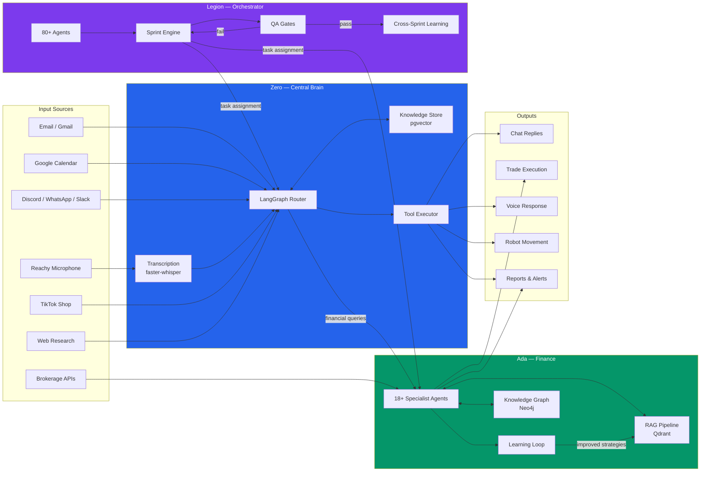
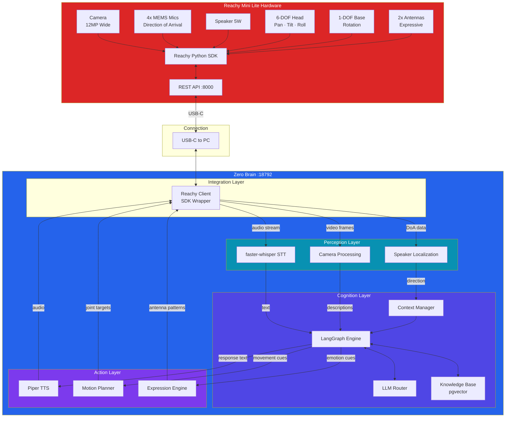
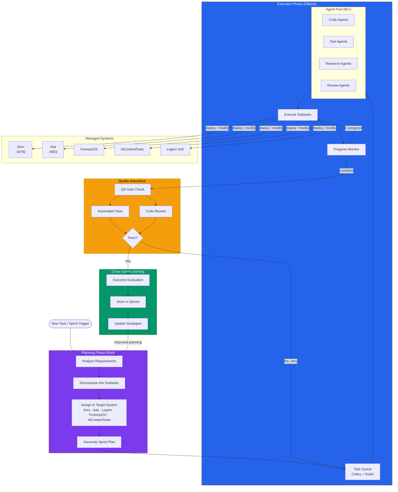

# Personal AI Ecosystem — Architecture

## 1. System Overview

```mermaid
graph TB
    subgraph Physical["Physical Layer"]
        Reachy["Reachy Mini Lite<br/>USB-C · REST :8000<br/>Camera · Mic · Speaker"]
    end

    subgraph Orchestration["Meta-Orchestration"]
        Legion["Legion :8005/3005<br/>FastAPI + React<br/>80+ Agents · Celery<br/>Autonomous Sprints"]
    end

    subgraph Core["Core Intelligence"]
        Zero["Zero :18792<br/>FastAPI + React<br/>LangGraph Engine<br/>Central AI Brain"]
        Ada["Ada :8003/5420<br/>FastAPI + React<br/>18+ Finance Agents<br/>LangGraph Workflows"]
    end

    subgraph Messaging["Messaging Channels"]
        Discord["Discord"]
        WhatsApp["WhatsApp"]
        Slack["Slack"]
    end

    subgraph LLM["LLM Providers"]
        Ollama["Ollama :11434<br/>Local Inference"]
        Gemini["Google Gemini"]
        Kimi["Kimi"]
        OpenRouter["OpenRouter"]
        HuggingFace["HuggingFace"]
    end

    subgraph Data["Data Stores"]
        PG_Zero["PostgreSQL :5433<br/>+ pgvector<br/>Zero"]
        PG_Ada["PostgreSQL :5432<br/>Ada"]
        PG_Legion["PostgreSQL :5434<br/>Legion"]
        Qdrant_Ada["Qdrant<br/>Ada Vectors"]
        Qdrant_Legion["Qdrant<br/>Legion Vectors"]
        Neo4j["Neo4j<br/>Ada Knowledge Graph"]
        Redis_Ada["Redis<br/>Ada Cache"]
        Redis_Legion["Redis<br/>Legion Queue"]
    end

    subgraph Finance["Brokerages"]
        Robinhood["Robinhood"]
        Alpaca["Alpaca"]
        Tradier["Tradier"]
    end

    subgraph Services["External Services"]
        Gmail["Gmail"]
        GCal["Google Calendar"]
        TikTok["TikTok Commerce"]
        PredMarkets["Prediction Markets"]
    end

    %% Legion orchestrates everything
    Legion -->|manages| Zero
    Legion -->|manages| Ada
    Legion -->|Kimi planning| Kimi
    Legion -->|Ollama execution| Ollama
    Legion --- PG_Legion
    Legion --- Qdrant_Legion
    Legion --- Redis_Legion

    %% Zero connections
    Zero -->|Claude Agent SDK| Discord
    Zero -->|Claude Agent SDK| WhatsApp
    Zero -->|Claude Agent SDK| Slack
    Zero -->|multi-provider| Ollama
    Zero -->|multi-provider| Gemini
    Zero -->|multi-provider| Kimi
    Zero -->|multi-provider| OpenRouter
    Zero -->|multi-provider| HuggingFace
    Zero --- PG_Zero
    Zero -->|email| Gmail
    Zero -->|calendar| GCal
    Zero -->|commerce| TikTok
    Zero -->|markets| PredMarkets

    %% Ada connections
    Ada --- PG_Ada
    Ada --- Qdrant_Ada
    Ada --- Neo4j
    Ada --- Redis_Ada
    Ada -->|trades| Robinhood
    Ada -->|trades| Alpaca
    Ada -->|trades| Tradier

    %% Reachy connects to Zero
    Reachy <-->|USB-C + REST| Zero

    %% Cross-system
    Zero <-->|data exchange| Ada

    style Zero fill:#2563eb,color:#fff,stroke:#1d4ed8
    style Ada fill:#059669,color:#fff,stroke:#047857
    style Legion fill:#7c3aed,color:#fff,stroke:#6d28d9
    style Reachy fill:#dc2626,color:#fff,stroke:#b91c1c
```



## 2. Voice Pipeline

```mermaid
sequenceDiagram
    participant Mic as Reachy Mic<br/>4x MEMS + DoA
    participant STT as faster-whisper<br/>STT Engine
    participant LG as Zero LangGraph<br/>Orchestration
    participant LLM as LLM Provider<br/>(Ollama/Gemini/etc)
    participant TTS as Piper TTS<br/>Engine
    participant Spk as Reachy Speaker<br/>5W Output

    Note over Mic,Spk: Voice Interaction Pipeline

    Mic->>STT: Raw audio stream
    Note right of Mic: Direction of Arrival<br/>selects speaker

    STT->>LG: Transcribed text + metadata
    Note right of STT: faster-whisper<br/>local inference

    LG->>LG: Intent classification<br/>& state management

    alt Simple query
        LG->>LLM: Prompt with context
        LLM->>LG: Response text
    else Tool use required
        LG->>LG: Execute tool nodes<br/>(email, calendar, etc.)
        LG->>LLM: Summarize results
        LLM->>LG: Natural language response
    end

    LG->>TTS: Response text
    Note right of TTS: Piper local TTS<br/>low latency

    TTS->>Spk: Audio stream
    Note right of Spk: Plays through<br/>Reachy speaker

    LG-->>Reachy Head: Expression cues
    Note over Reachy Head: Head movement<br/>antenna animation

    participant Reachy Head as Reachy Motors<br/>9 DOF
```

## 3. Data Flow



## 4. Service Dependency Map

```mermaid
graph BT
    subgraph Infrastructure["Shared Infrastructure"]
        Docker["Docker Compose"]
        Ollama["Ollama :11434"]
        PG5432["PostgreSQL :5432"]
        PG5433["PostgreSQL :5433<br/>+ pgvector"]
        PG5434["PostgreSQL :5434"]
        Redis1["Redis (Ada)"]
        Redis2["Redis (Legion)"]
        Qdrant1["Qdrant (Ada)"]
        Qdrant2["Qdrant (Legion)"]
        Neo4j["Neo4j"]
    end

    subgraph External["External APIs"]
        Gemini["Gemini API"]
        KimiAPI["Kimi API"]
        OR["OpenRouter API"]
        HF["HuggingFace API"]
        RH["Robinhood API"]
        ALP["Alpaca API"]
        TRD["Tradier API"]
        GAPI["Google APIs"]
        TTAPI["TikTok API"]
    end

    subgraph Apps["Applications"]
        Zero["Zero :18792"]
        Ada["Ada :8003"]
        Legion["Legion :8005"]
        Reachy["Reachy :8000"]
    end

    %% Zero dependencies
    Zero --> PG5433
    Zero --> Ollama
    Zero --> Gemini
    Zero --> KimiAPI
    Zero --> OR
    Zero --> HF
    Zero --> GAPI
    Zero --> TTAPI
    Zero --> Docker

    %% Ada dependencies
    Ada --> PG5432
    Ada --> Qdrant1
    Ada --> Neo4j
    Ada --> Redis1
    Ada --> Ollama
    Ada --> RH
    Ada --> ALP
    Ada --> TRD
    Ada --> Docker

    %% Legion dependencies
    Legion --> PG5434
    Legion --> Qdrant2
    Legion --> Redis2
    Legion --> Ollama
    Legion --> KimiAPI
    Legion --> Docker

    %% Reachy depends on Zero
    Reachy --> Zero

    %% Cross-app
    Legion -.->|orchestrates| Zero
    Legion -.->|orchestrates| Ada
    Zero -.->|queries| Ada

    style Infrastructure fill:#f59e0b,color:#000
    style Apps fill:#3b82f6,color:#fff
    style External fill:#6b7280,color:#fff
```



## 5. Reachy Integration Architecture



## 6. Legion Orchestration Flow


