# Zero — Architecture

> Zero is Adam's chief-of-staff and the active home for ADA AI LLC
> Company OS (see [`MANDATE.md`](../MANDATE.md)). FastAPI backend on `:18792`,
> React/Vite UI on `:5173`. It combines the personal assistant, second brain,
> company task cockpit, approvals, docs context, consulting/product/robotics
> operations, content automation, voice, vault, journaling, habits, goals,
> vision, ecosystem health, and Reachy Mini control.

## Top-down view

```mermaid
graph TB
    subgraph Surfaces["User surfaces"]
        UI["React UI :5173"]
        API["REST :18792"]
        Voice["Reachy Mini :8000<br/>(USB-C + REST)"]
        SDK["Claude Agent SDK<br/>(Discord / WhatsApp / Slack)"]
    end

    subgraph Vault["Obsidian vault (source of truth)"]
        Daily["20_Calendar/Daily/"]
        Atlas["10_Atlas/MOCs"]
        Efforts["30_Efforts/"]
        AgentNS["00_Meta/_agent/<br/>(agent-owned namespace)"]
        Inbox["_Inbox/"]
    end

    subgraph Cognition["Cognition"]
        Indexer["vault_indexer_service<br/>watchdog + chunker + embedder"]
        Retriever["vault_retrieval_service<br/>BM25 + dense + RRF + journal time-decay"]
        Writer["vault_writer_service<br/>(Stage 1 → cyanheads MCP)"]
        Routine["daily_routine_service<br/>+ morning_digest_service"]
    end

    subgraph PersonalLayer["Personal layer"]
        Mem["memory_service"]
        Goal["goal_tracking_service"]
        Habit["habit_service"]
        Journal["journal_service"]
        Email["email_draft_service"]
        Feedback["feedback_service"]
        Context["context_awareness_service"]
        Cross["cross_domain_service"]
        Proactive["proactive_service"]
        Health["ecosystem_health_service"]
    end

    subgraph CompanyOS["Company OS layer"]
        CompanyUI["/company routes"]
        CompanyDocs["docs/company"]
        CompanyCtx["company_context_service"]
        CompanyApprovals["approval guardrails"]
    end

    subgraph VoiceStack["Voice stack"]
        Wake["reachy_wake_word_service<br/>('Hey Zero')"]
        STT["faster-whisper STT<br/>(distil-large-v3)"]
        TTS["tts_service<br/>(edge-tts / Piper / Kokoro target)"]
        Loop["voice_loop_service<br/>+ voice_bridge_service"]
        Reachy["reachy_service +<br/>persona / motion / emotion / vision"]
    end

    subgraph LLM["LLM layer (all via LiteLLM :4444)"]
        Router["LiteLLM router :4444"]
        VLLMChat["vllm-chat :18800<br/>Qwen3-32B-AWQ"]
        VLLMEmbed["vllm-embed :8001<br/>Qwen3-Embedding-0.6B"]
        Cloud["Anthropic / Gemini / Kimi / MiniMax / OpenRouter"]
        Ollama["Ollama :11434<br/>fallback"]
    end

    subgraph Storage["Storage"]
        PG["Postgres :5433<br/>+ pgvector"]
        WS["workspace/ + backups/"]
    end

    subgraph Bridges["Cross-project bridges"]
        Legion["legion-mcp<br/>(Stage 2)"]
        Ada["ada-mcp<br/>(Stage 2)"]
        Cyanheads["cyanheads-obsidian<br/>(Stage 1)"]
    end

    UI --> API
    Voice --> Wake --> STT --> Loop
    Loop --> Router
    Router --> VLLMChat
    Router --> VLLMEmbed
    Router --> Cloud
    Router --> Ollama
    Loop --> TTS --> Voice
    Loop --> Reachy
    Loop -->|append| Daily

    SDK --> API

    API --> Indexer
    API --> Retriever
    API --> Writer
    Writer --> Cyanheads --> Vault
    Indexer --> PG
    Retriever --> PG
    Indexer --> Vault

    API --> Routine
    UI --> CompanyUI
    CompanyUI --> API
    API --> CompanyCtx --> CompanyDocs
    API --> CompanyApprovals
    Routine --> Daily
    Routine --> Mem
    Routine --> Goal
    Routine --> Habit
    Routine --> Journal
    Routine --> Email
    Routine --> Health

    API --> Bridges
    Legion --> Vault
    Ada --> Vault

    style Vault fill:#f59e0b,color:#000
    style LLM fill:#2563eb,color:#fff
    style VoiceStack fill:#dc2626,color:#fff
    style Cognition fill:#059669,color:#fff
```



## Vault contract (the most important file boundary)

The vault at `C:\code\vault\ObsidianZero` is mounted into the Zero container at `/vault:rw`. Zero is the only writer; other agents (Legion, Ada) write through Zero's `vault_writer_service` or directly via `cyanheads-obsidian` MCP using the same `agent_writable` whitelist.

The vault constitution at `00_Meta/CLAUDE.md` enforces:

1. Check `agent_writable` frontmatter before any write.
2. Append-only under heading markers: daily notes use `## Agent Summary`, `## Commits`, `## Research`, `## 🎙️`. Project notes use `## Agent Log`. Free write only in `_agent/`.
3. Mtime check before write; requeue on conflict.
4. Audit footer: `<!-- agent-run-id: {uuid} source: zero at: {iso8601} -->`.
5. Never touch `.obsidian/`, `.git/`, `.trash/`.
6. Partition tag every event: `personal | trading | zero-dev`. **Never `work`.**

Stage 1 replaces the filesystem-direct `vault_writer_service` with a cyanheads-obsidian MCP client for writes outside `_agent/`. Reads continue through `vault_indexer_service` (filesystem-direct, watchdog-driven, polling-fallback for OneDrive).

## Retrieval architecture

```
File save → watchdog (30s debounce, hash dedup, polling fallback)
         → frontmatter parse (kept as structured metadata)
         → markdown header-hierarchical chunking (~512 tok, 15% overlap, wikilinks preserved)
         → Qwen3-Embedding-0.6B via LiteLLM :4444 (qwen3-embed)
         → INSERT into pgvector with partition tag (reference|projects|journal|inbox)
                                                          ↓
Query → Haiku 4.5 partition classifier → BM25 (tsvector) + dense (cosine) → RRF fuse
       → Stage 1: Qwen3-Reranker-0.6B over top-50
       → time-decay only on journal partition: 0.7 cos + 0.3 * 0.5^(age_days/30)
       → return top-K to caller
```

Partitions:
- `reference` = `10_Atlas/`, `40_Resources/` — no time decay; Stage 1 adds Contextual Retrieval pre-embed prefix
- `projects` = `30_Efforts/**` — no time decay
- `journal` = `20_Calendar/**` — time decay applied
- `inbox` = `_Inbox/**` — surface most-recent strongly

## Voice stack

```
Reachy mic (4x MEMS + DoA)
  → Silero VAD (Stage 5 verify)
  → openWakeWord ("Hey Zero")  [reachy_wake_word_service.py]
  → faster-whisper distil-large-v3                    [warmed at startup]
  → voice_loop_service → LiteLLM :4444 → vLLM Qwen3-32B chat
  → tts_service (Stage 5 → Kokoro 82M via :8880)
  → Reachy speaker + reachy_motion_library / reachy_emotion_parser cues
  → voice_bridge_service appends turn to today's daily note '## 🎙️'
```

Reachy daemon listens on host `:8000` (USB-C). Zero connects via `ZERO_REACHY_API_URL=http://host.docker.internal:8000`. `ZeroHostAgent` Windows Scheduled Task supervises Reachy on the host.

## 24/7 substrate (Zero side)

- Backend container: `restart: unless-stopped` (docker-compose.sprint.yml).
- APScheduler in-process with Postgres job store: morning digest, Reachy memory compaction (6h), HA gesture watcher, Reachy presence scheduler.
- Stage 0 adds: NSSM service `Zero-Stack` for unattended boot, ecosystem health watchdog writing to today's daily note.

## Storage

| Store | Where | Schema highlights |
|---|---|---|
| Postgres :5433 | `host.docker.internal:5432` (native Win PG17, pgvector 0.8.0) | `vault_chunks (id, path, partition, content, embedding vector(1024), tsvector)`, `conversation_sessions`, `conversation_messages`, `user_feedback`, `learned_preferences`, `user_goals`, `goal_checkins`, `habits`, `habit_logs`, `journal_entries`, `vault_approvals` |
| Vault | `C:\code\vault\ObsidianZero` (mounted as `/vault`) | ACE+JD layout with `00_Meta/`, `10_Atlas/`, `20_Calendar/`, `30_Efforts/`, `40_Resources/`, `90_Archive/`, `_Inbox/` |
| Workspace | `./workspace` | Recordings, agent outputs, temp |
| Company docs | `C:\code\zero\docs\company` | ADA AI LLC operating manual, sources, architecture, task system, finance/legal checklists |

The former standalone `C:\code\company` project is now a legacy archive. Zero is
the active app, API, docs context, and task surface for Company OS.

Note: there is a stale nested vault at `C:\code\vault\ObsidianZero\Zero\.obsidian` from an early "Open vault here" misclick. It contains only the default Obsidian Welcome.md and is safe to delete in a sweep — the canonical vault root is `ObsidianZero/`.

## LLM routing (canonical names → backend, all via LiteLLM :4444)

| Use | Canonical name | Notes |
|---|---|---|
| Default chat / synthesis | `qwen3-chat` | Local vLLM, privacy-safe, ~$0/MTok |
| Coding | `qwen3-coder` | Same backend, naming convention only |
| Embedding | `qwen3-embed` | Local vLLM embed |
| Long context (>200K) | `claude-sonnet-4-6` | Cloud, $3/$15 per MTok |
| Cheap classification | `claude-haiku-4-5` | Cloud, $1/$5 per MTok |
| Vision | `gemini-flash-latest` | Cloud, vision-capable |
| Cloud fallback | `kimi-k2.5` → `minimax-m2` → `qwen3-chat` | Configured in LiteLLM `fallbacks` |

The shared LiteLLM config lives at `C:\code\shared-infra\litellm\config.yaml`. When a backend port or provider changes, that file changes — Zero's env vars stay the same (`ZERO_VLLM_CHAT_URL=http://host.docker.internal:4444/v1`).

## Stage roadmap (per the active plan)

| Stage | What changes for Zero |
|---|---|
| 0 (Week 1) | NSSM `Zero-Stack` service. Health watchdog writes to daily note. Vault subfolder cleaned up. |
| 1 (Weeks 2–3) | `vault_writer_service` switches to cyanheads MCP for writes outside `_agent/`. Reranker added. Contextual Retrieval prep on `reference` partition. |
| 2 (Weeks 4–5) | `zero-mcp` exposed; consumes `legion-mcp` + `ada-mcp`. Daily Brief Agent (in Legion) feeds today's daily note. |
| 3 (Weeks 6–7) | Hands off PKM and trading questions to Legion's LangGraph supervisor via MCP. |
| 4 (Weeks 8–9) | Receives drift alerts in daily note Attention queue. DND honored on all proactive nudges. |
| 5 (Weeks 10–12) | Voice stack hardened: Silero VAD verified, Kokoro TTS, LiveKit Agents bridge. |

## References

- Mandate: [`../MANDATE.md`](../MANDATE.md)
- Company docs: [`company/INDEX.md`](company/INDEX.md)
- Ecosystem mandate: [`C:\code\MANDATE.md`](../../MANDATE.md)
- Architecture (ecosystem): [`C:\code\ARCHITECTURE.md`](../../ARCHITECTURE.md)
- Active plan: `C:\Users\hadam\.claude\plans\review-the-two-lively-cascade.md`
- Vault constitution: `C:\code\vault\ObsidianZero\00_Meta\CLAUDE.md`
- Coding rules: `../CLAUDE.md`
- Shared infra: `C:\code\shared-infra\README.md`
